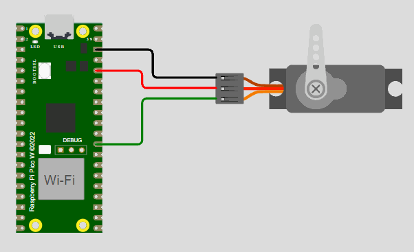

# ✨ Tarefa07-Modulaçao de Largura de Pulso

 Repositório dedicado a Tarefa 07 do processo de capacitação do EmbarcaTech que envolve modulação de largura de pulso (PWM) na placa Raspberry Pi Pico W por meio da Plataforma BitDogLab.

## :clipboard: Apresentação da tarefa

Para consolidar a compreensão dos conceitos relacionados ao uso de PWM no microcontrolador RP2040 e explorar as funcionalidades da placa de desenvolvimento BitDogLab, esta atividade propõe a implementação de um projeto simulado envolvendo o controle de um servomotor por meio de modulação por largura de pulso. O projeto controla o servomotor para operar entre os ângulos de 0 a 180.

## :dart: Objetivos

- Compreender o funcionamento e a aplicação de modulação de largura de pulso em microcontroladores;

- Compreender o funcionamento de servomotores;

- Obter uma frequência de pwm de 50 Hz;

- Manter por um período de tempo o servomotor em ângulos fixos (180, 90 e 0 graus);

- Criar uma rotina que faça o servomotor se deslocar entre os ângulos de 0 a 180 graus de maneira suave;

- Observar o funcionamento do PWM na plataforma BitDogLab por meio do LED RGB.

## :books: Descrição do Projeto

Utiizou-se o Wokwi Simulator associado ao VScode para a simulação de um código na placa Raspberry Pi Pico W que controla um servomotor por meio de PWM. O controle exige pulsos na ordem dos microsegundos, que permite o servomotor se manter em ângulos fixos. Depois é observado o comportamento do código na plataforma BitDogLab com um LED RGB.

## :walking: Integrantes do Projeto

- Matheus Pereira Alves

## :bookmark_tabs: Funcionamento do Projeto

- É necessário a utilização da biblioteca "hardware/pwm" e sua eventual configuração no CMAKElist.txt;
- O pulso modulado faz com que o servomotor opere em ângulos fixos;
- O TOP (wrap) escolhido foi de 25000 e o divisor de clock (DIV) de 100, com isso foi possível obter uma frequência de 50 Hz requisitada;
- É utilizado uma rotina de repetição para que o código mantenha-se ciclamente entre os ângulos de 0 a 180 graus;
- Após a instalação do código na plataforma BitDogLab utilizando o PWM no GPIO 12, é possível notar a variação da intensidade luminosa por parte do LED azul, isso se dá devido a mudança da potência média no mesmo, que resulta da variação do *duty cicle* do PWM.

## 🧮 Simulação do projeto

- É necessário ter o VScode instalado
- É necessário ter o C/C++ e CMAKE instalados como extensão VScode
- É necessário ter o Wokwi Simulator instalado como extensão do VScode e uma chave ativa
- É necessário compilar o arquivo.c por meio da extensão oficial do Raspberry Pi Pico
- Utilize o arquivo diagram.json para rodar a simulação

## :camera: GIF mostrando o funcionamento do programa por meio do simulador integrado Wokwi

  

